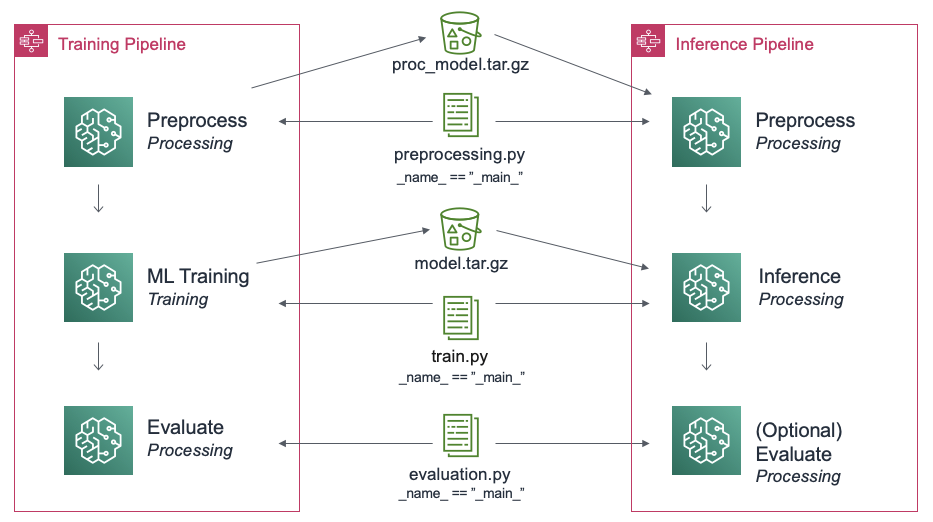
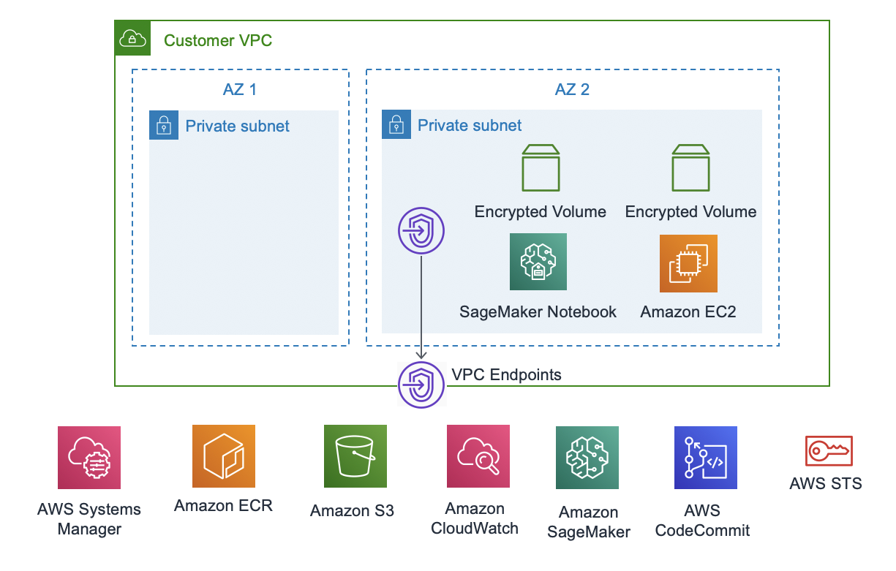

# What is ML Max?
Delivering ML solutions to production is hard. It is difficult to know where to
start, what tools to use, and whether you are doing it right. Often each
individual professional does it a different way based on their individual
experience or they use prescribed tools developed within their company. Either
way this requires a lot of investment of time to firstly decide what to do and
secondly to implement and maintain the infrastructure. There are many existing
tools that make parts of the process faster but many months of work is still
required to tie these together to deliver robust production infrastructure.

ML Max is a set of example templates to accelerate the delivery of custom ML solutions to
production so you can get started quickly without having to make too many
design choices.

## Quick Start Usage

1. [**ML Training Pipeline**](modules/pipeline/README.md): This is the process to set up standard training
   pipelines for machine learning models enabling both immediate
experimentation, as well as tracking and retraining models over time.
2. [**ML Inference Pipeline**](modules/pipeline/README.md): Deploys a model to be used by the business in
   production. Currently this is coupled quite closely to the ML training pipeline
as there is a lot of overlap.
3. [**Development environment**](modules/environment/README.md): This module manages the provisioning of
   resources and manages networking and security, providing the environment for data
scientists and engineers to develop solutions.

## Training and Inference Pipeline

Create a semi-automated Training and Inference Pipeline using CloudFormation,
Step Functions, and Amazon SageMaker. 

See [quick start documentation](modules/pipeline/README.md) for details.

## Environment

Get started with a working environment with encryption and network isolation.

See [quick start documentation](modules/environment/README.md) for details.

## Links

* [Creating a Training and Inference Pipeline](modules/pipeline/README.md)
* [Setting up an Environment](modules/environment/README.md)
* [PR FAQ](PRFAQ.md)
* [Configuring your Jupyter Notebook](notebooks/example_notebook.ipynb)
* [Best Practices](BEST_PRACTICES.md)
* [Contributing](CONTRIBUTING.md)

## Security

See [CONTRIBUTING](CONTRIBUTING.md#security-issue-notifications) for more information.

## License

This project is licensed under the Apache-2.0 License.

