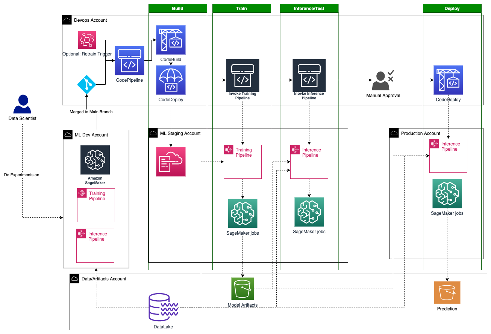
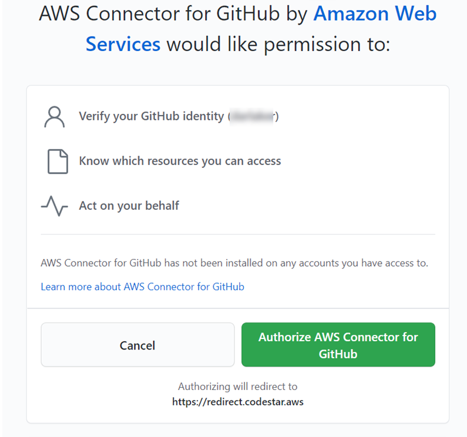
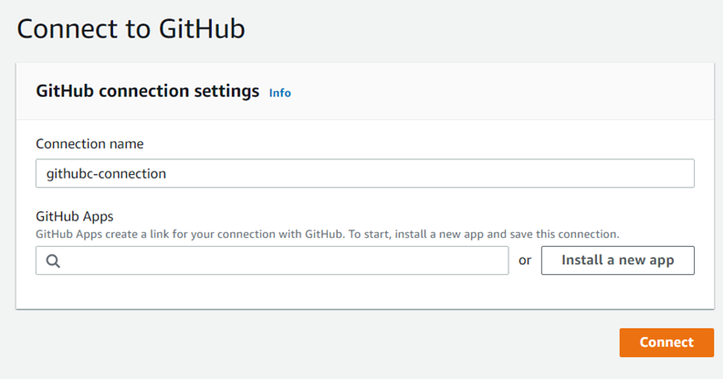
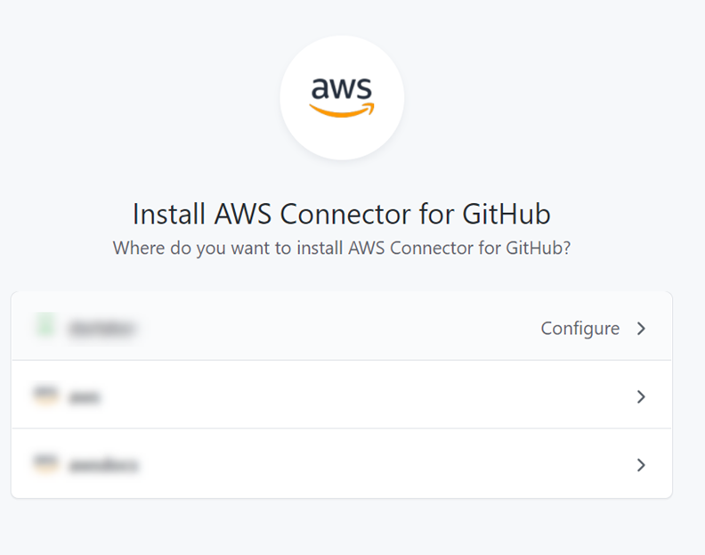
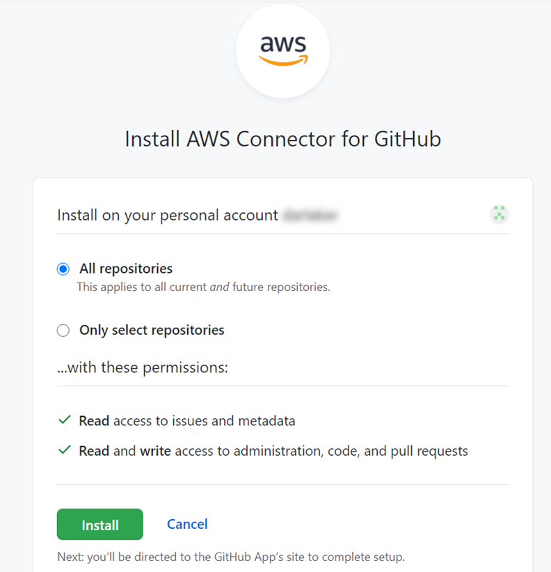
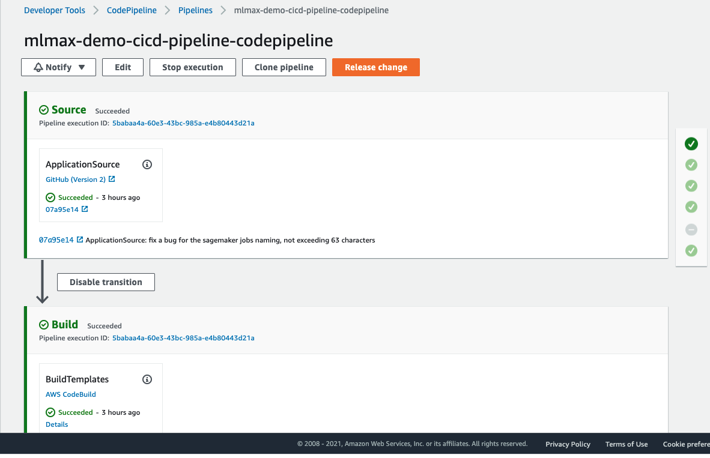
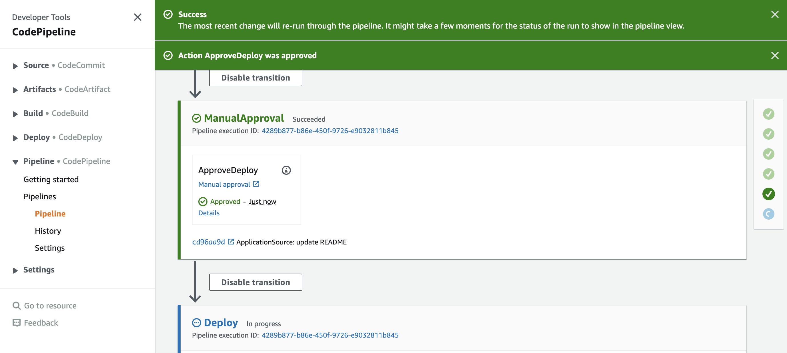
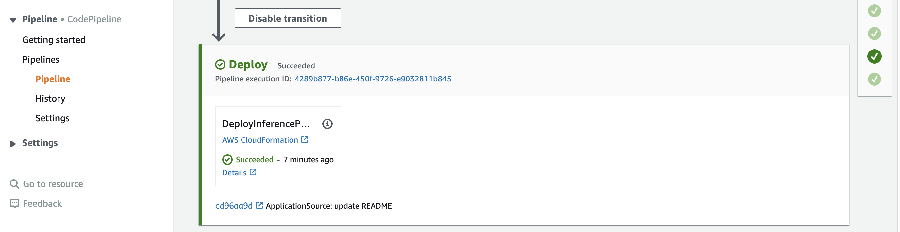
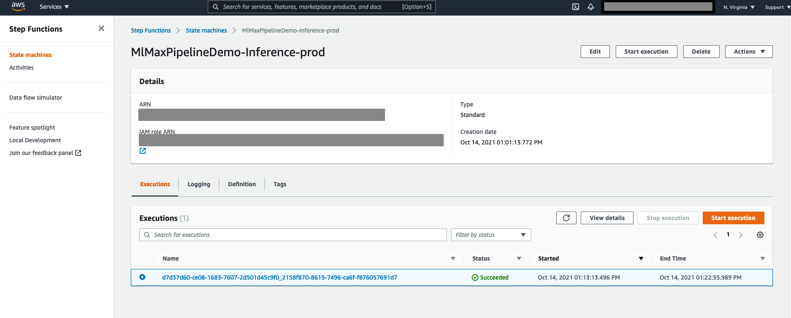
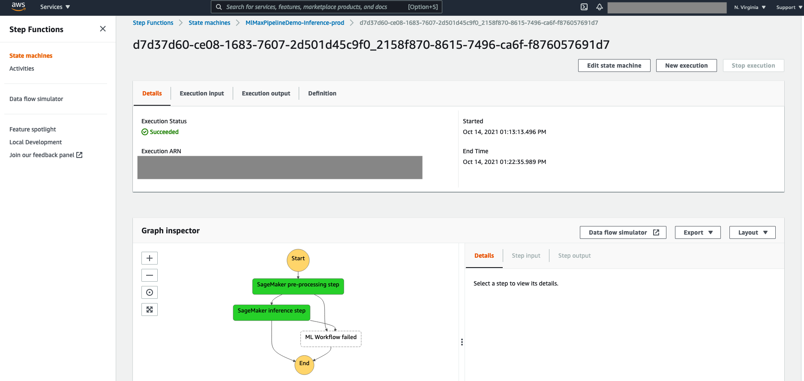

# Set up the CICD for the ML pipelines

## High level Architecture

The CICD can be set up using a AWS codepipeline, as shown in the chart, it involves 5 accounts: (The accounts in red are needed to be created)

- `Devops Account`: The account manages the build and deployment of the mlops.

- `ML DEV Account`: The account data scientists and ML engineers can experiment their ML/AI models and pipelines.

- `ML Staging Account`: The account where the automated model training and testing happens.

- `ML Production Account`: The account where the production ML inference pipeline is deployed.

- `Data/Arifacts Account`: The account manages the datalake, model artefacts and ML model predictions.

Also it consists of 5 stages:

- `Build`: In this stage, when there is new changes pushed into the git repo, the codeBuild is used to build the cloudformation templates for the training and inference pipelines.

- `Train`: In this stage, the training pipeline in the staging account is automatically triggered and a model is trained.

- `Inference/Test`: In this stage, the inference pipeline in the staging account is automatically triggered and it uses the trained model to do inference. This is a good integration test to see if the inference pipeline works fine, and check if the trained model and inference pipeline are ready to be deployed into production.

- `Manual Approval`: In this stage, add the manual approval to ensure everything is fine before the deployment.

- `Deploy`: Deploy the ML inference pipeline into the production account.

**For simplicity, this implementation assumes Data/artifact and Devops accounts are the same here, and ML Dev account is not used here.**

## Getting Started
> make sure your aws cli in the `us-east-1` region

### Step 0: Download the repo

    git clone https://github.com/awslabs/mlmax.git
    cd modules/cicd

### Step 1: Customize your config file at ./config/cicd.ini
> Replace the following config file with your own AWS accounts.

    DevopsAccountId=xxxxxxxxxxxx
    StageAccountId=xxxxxxxxxxxx
    ProdAccountId=xxxxxxxxxxxx

### Step 2: Set up cross account IAM roles

#### In `Devops Account` AWS cli, run the command line below:

    ./create_roles.sh devops

#### In `Stage Account` AWS cli, run the command line below:

    ./create_roles.sh stage

#### In `Prod Account` AWS cli, run the command line below:

    ./create_roles.sh prod

### Step 3: In `Devops Account` AWS cli, Create the cloudformation stack for the Codepipeline (CI/CD)

    ./deploy.sh

### Step 4: The first time you set up the above CICD CodePipeline, you need too use the Developer Tools console to complete a pending connection.
1. Open the AWS Developer Tools console at https://console.aws.amazon.com/codesuite/settings/connections.

2. Choose **Settings > Connections**. The names of all connections associated with your AWS account are displayed.

3. In Name, choose the name of the pending connection you want to update. Update a pending connection is enabled when you choose a connection with a Pending status.

4. Choose Update a pending connection.

5. Choose **Authorize AWS Connector for GitHub**. The connection page displays and shows the GitHub Apps field.

6. Under GitHub Apps, choose an app installation or choose **Install a new app** to create one.

7. On the Install AWS Connector for GitHub page, choose the account where you want to install the app.

8. On the Install AWS Connector for GitHub page, leave the defaults, and choose Install.

9. On the **Connect to GitHub page**, the connection ID for your new installation appears in GitHub Apps. Choose **Connect**.

### Step 5: Go to your CodePipeline and release changes to trigger the running of the CodePipeline.
1. open the CodePipeline console at http://console.aws.amazon.com/codesuite/codepipeline/home.

2. In Name, choose `mlmax-demo-cicd-pipeline-codepipeline`.

3. On the pipeline details page, choose Release change. This starts the most recent revision available in each source location specified in a source action through the pipeline.

### Step 6: Manually approve the deployment to `Prod Account`
1. Scroll down to the `Manual Approval` Stage, and **click review and approve**.

2. Wait a couple of minutes to see if the inference pipeline is successfully deployed to `Prod Account`

### Step 7: Check the run results on `Prod Account`.
> In this demo, the inference pipeline is scheduled to be executed daily, so it might take some time to see it will be executed on the Prod account.

1. Log on to the AWS console of the `Prod Account`.

2. Open the StepFunction console at https://console.aws.amazon.com/states/home

3. In Name, choose `MlMaxPipelineDemo-Inference-prod`

4. Check if the latest execution is successful.

5. You can further check the details of the execution by clicking the execution.

## To do
- Support deploy in multiple regions
- Add support fork from mlmax to automatically trigger the Codepipeline
- Add support for retrain trigger.
