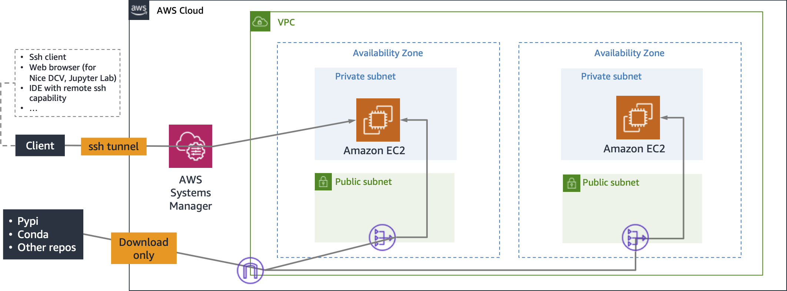

# Development Environment

The Environment module manages the provisioning of resources and manages access
controls, providing the environment for data scientists and engineers to
develop solutions.


## Design Principles

| Principle                                                                        | Description                                                                                                                                                                                                                                                          |
| -------------------------------------------------------------------------------- | ---------------------------------------------------------------------------------------------------------------------------------------------------------------------------------------------------------------------------------------------------------------------|
| Promote basic software development best practices.                               | Many data scientists come from a non-CS background, and thus it is important emphasize the benefit of tools and techniques of software development.                                                                                                                  |
| Provide a flexible set of baseline services.                                     | Data Scientists should be enabled to develop code in any environment capable to run remote python interpreter including modern IDEs (e.g., VS Code,), traditional IDEs (e.g., vim) or jupyter notebooks. There should not be a single, "one-size-fits-all" approach. |
| Operate in an isolated environment that still allows packages/libraries installs | This means resources will have to reside in a private VPC.                                                                                                                                                                                                           |



## Quick Start

1) Prepare a S3 bucket in the same region to store cloudformation
intermediate metadata. This could be an existing bucket or a new bucket. You
must be able to write to this bucket. This is a different bucket than the one
specified in Step 1.

2) To deploy, run the command `deploy.sh [stack-name] [cloudformation-bucket] [region]`
   - Cloundformation bucket be in the same region specified by `region` argument.
   - If no `region` argument is provided, default region in `.aws/config` will be used.

## Architecture

**VPC**

- Two Private Subnets only across different availability zones
- Two public subnets with Internet Gateway and NAT Gateway
- Security group without open ports to anything outside this VPC.

**EC2**

Instances are launched to the private subnets. The instances can still install
or update packages, libraries, or dependencies from public repos, however,
unsolicited ingress traffic from the public internet are blocked.

- Use AMI with SSM Agent to support remote SSH using existing key pair
- First verify that Session Manager Plugin is installed on your local workstation by running the command below
- Or follow the instruction [here](https://docs.aws.amazon.com/systems-manager/latest/userguide/session-manager-working-with-install-plugin.html#install-plugin-verify) to install SSM agent

```
aws ssm start-session --target <ec2-instance-id>
```

- Update SSH config to be able to SSH to EC2 using command `ssh ec2-ssm`.

```
# Add the following in your SSH config

Host ec2-ssm
    HostName <ec2-instance-id>
    User ec2-user
    IdentityFile /path/to/keypair/pemfile
    ProxyCommand sh -c "aws ssm start-session --target %h --document-name AWS-StartSSHSession --parameters 'portNumber=%p'"
```

## Ergonomic aspect

To improve quality-of-life, additional scripts are provided:

- `mlmax/modules/environment/util/install-dcv.sh`: a bash script to install
  Nice DCV on an EC2 instance. Note that there's already has an AMI
pre-installed with Nice DCV. So, you can use this script for DLAMI, or say,
when you want to use the latest alinux2 AMI.
