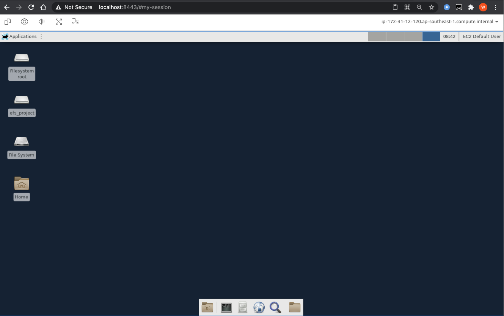

# Remote Desktop to EC2 using NICE DCV


This prescriptive guidance focusing on setting up remote desktop connection to EC2 to support application with GUI. This comes in handy when data scientists need to review document (pdf, scanned) or images during their work. Instead of downloading files onto local workstation or using Jupyter notebook which requires writing additional code, data scientists can install applications such as Acrobat Reader, GIMP.

You can find out more on NICE DCV [here](https://aws.amazon.com/hpc/dcv/).


Please note that this guide is written for NICE DCV running on an **EC2 within a private subnet**, and ssh-over-ssm is enabled to the EC2 instance. In addition, connections to dcv sessions **must** be done over an ssh-tunnel.


### Setup SSH config with tunneling

Update your ssh configuration to enable tunneling for port.

```
Host myec2
    HostName <instance-id>
    User ec2-user
    IdentityFile /Users/yihyap/Documents/awskey/sg-aws-sandbox-keypair.pem
    ProxyCommand sh -c "aws ssm start-session --target %h --document-name AWS-StartSSHSession --parameters 'portNumber=%p'"
    LocalForward 8443 localhost:8443
```


### Install  NICE DCV on EC2

After connecting to EC2, download installation script from https://github.com/awslabs/mlmax/blob/baseline-dev-env/modules/environment/baseline-dev-env/install-dcv.sh

Execute the command below:

```
chmod +x install-dcv.sh
./install-dcv.sh
```

Once installation is done, **reboot** the EC2 instance.

Further customizations:

* The script hardcodes the version of NICE DCV to 2020.02, which is the latest version as of this writing.
* The script installs many fonts, which can take some time to complete. To speed-up the installation time, feel free to edit the installs script to remove fonts that you don’t need.
* The script installs XFCE desktop. Your favorite desktop environment might differ, so please refer to their installation instruction, then customize the install script accordingly.


### Start DCV session

After reboot, start DCV session using the command below:

`dcv create-session --type virtual --init /usr/bin/startxfce4 my-session`

Verify dcv is running:


### Connect to Remote Desktop using browser

You are now able to connect using remote desktop by using the following URL on browser, which go through the port-8443 ssh tunnel that you’ve setup earlier:

https://localhost:8443/#my-session



Terminate session: on ec2, run dcv stop-session ...
